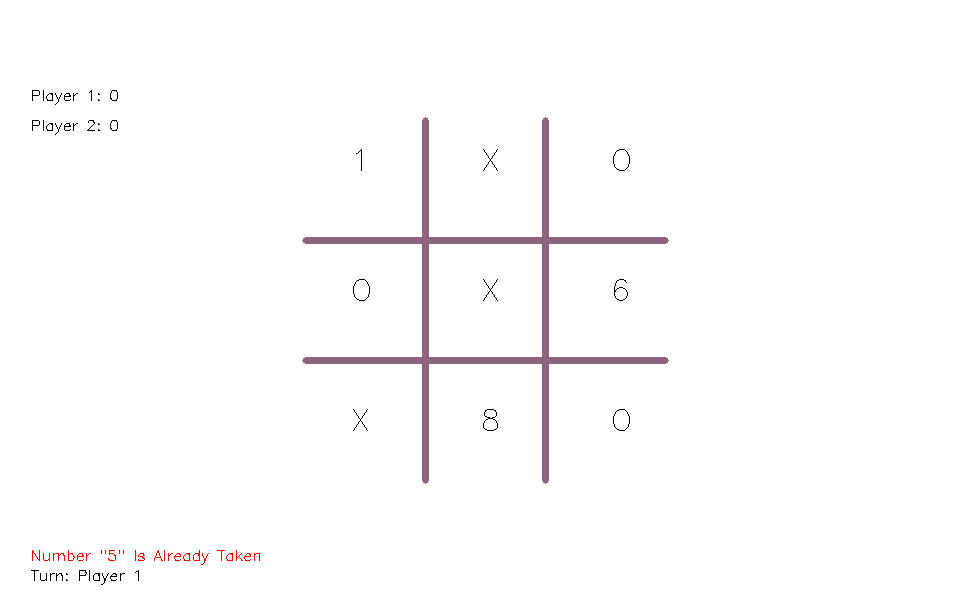

# Tic-Tac-Toe
Python-OpenCV-TicTacToe  
Two-player Tic-Tac-Toe game.  
  

Rule #1: You win if you select three numbers on a straight line.  
Rule #2: Only numbers from zero to nine are allowed.  
  
  
  
Rule #3: A number cannot be selected more than onec.

End the program by pressing "Esc" at any stage. 
A rematch starts 10 seconds after a player wins.  
It will be continued until a player wins 10 times.  
